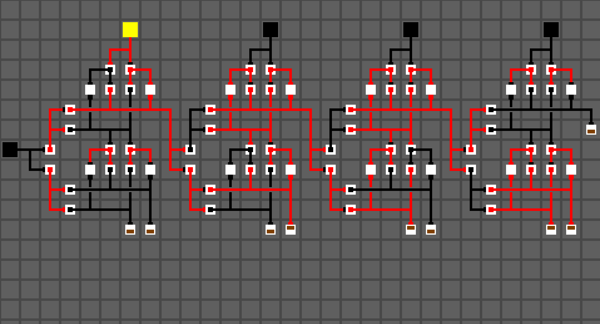

# wiregrid

Blazing fast 2D digital logic simulation, inspired by [Logic
World](https://logicworld.net). Prerelases coming soon!

## License

Wiregrid is distributed under the terms of both the MIT license and the Apache
license version 2.0. See [LICENSE-APACHE](LICENSE-APACHE),
[LICENSE-MIT](LICENSE-MIT), and [COPYRIGHT](COPYRIGHT) for details.

